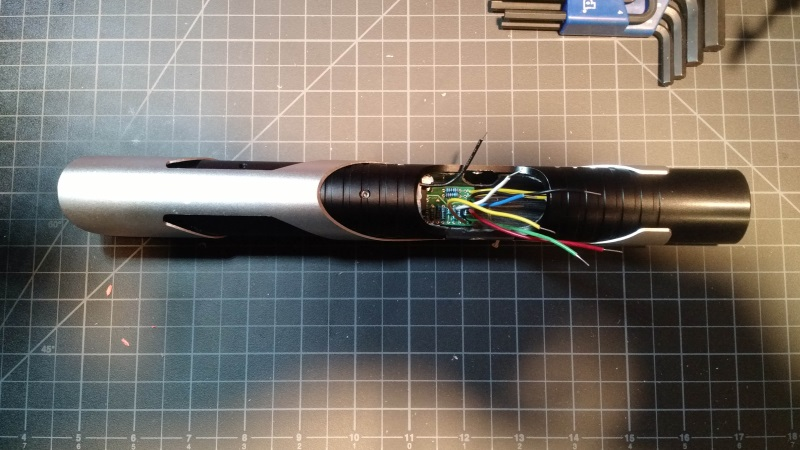
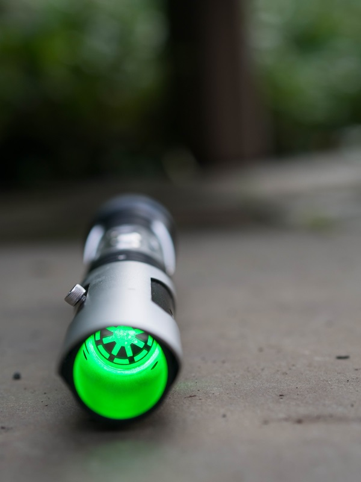
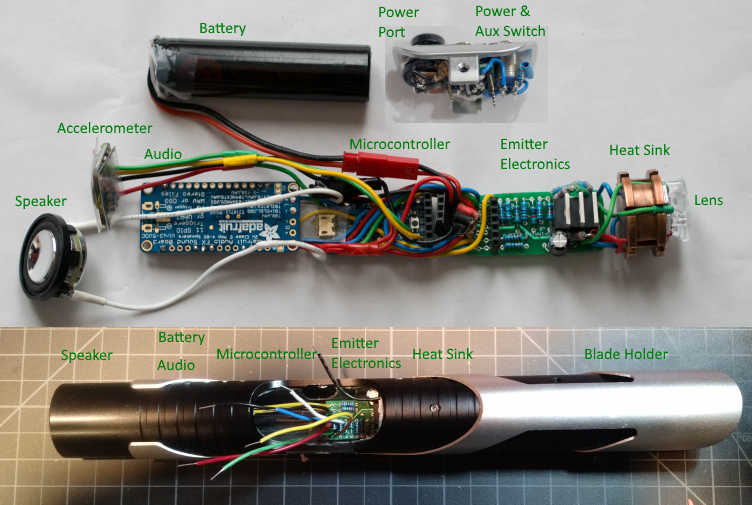
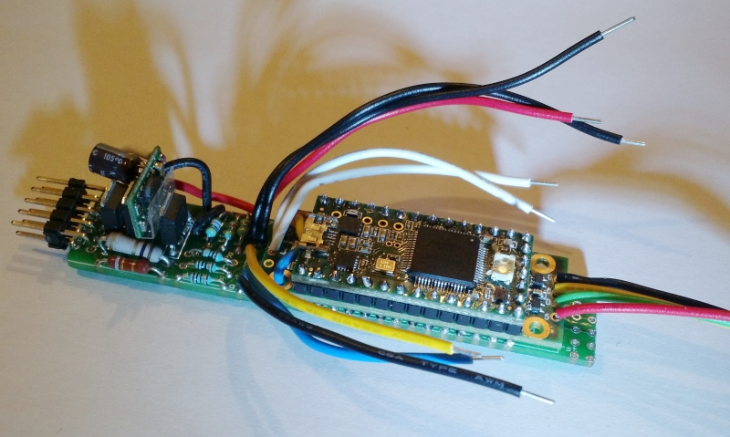
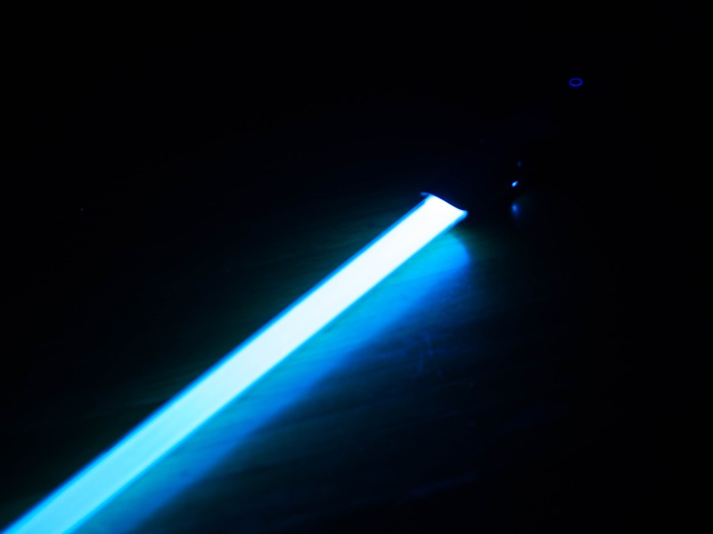

**Welcome to Open Saber**

The goal of open saber is provide source code, circuit diagrams, and 
documentation for making an Arduino (and compatible) based lightsaber.
The focus is on the internals of the saber, not how to build the case.

Why? For the joy of the problem, working together, and learning / playing
with Arduinos. There are certainly commercial solutions to saber electronics,
but if you want to build and contribute to the code and internals, this site
is for you!

The information and documentation assume a basic knowledge of Arduinos,
electronics, soldering, etc.



The Open Saber site / repo is 3 things:
- Overview of the (electrical) design of a saber.
- Source code for blade ignition, color, sound, etc. that runs on
  arduino class micro-controllers.
- Documentation & circuit diagrams for circuits and components.

The example platform is the "Gecko" saber, which is a SaberZ Sentris body (the
empty hilt option) with Open Saber electronics. You can see it in action
here: https://youtu.be/9_-Rfe4UBJM.

## Features:
- Support for 3 LED RGB "any color" saber 
- Flash on clash
- Motion and impact detection
- Sound font support
- Constant (average) current to LEDs
- Battery level tracking and indicator
- Command set to program saber with computer
- Recharge port / kill key port

## Status & Direction

There are over 5 working sabers on the OpenSaber design with cases
by SaberZ and UltraSabers. (With TCSS V1 cases and SaberForge ASP
in the works.)

The version number - as much as it is consistent - references
the PCB board. The PCB board determines the electrical architecture
and features.

- Based on Teensy 3.2 microcontroller.
- The V5 optionally uses a PJRC Prop Shield. The prop shield condenses
  a bunch of the electronics into one board, which is very 
  handy. (Although sometimes it's useful to spread components out, to
  be able to utilize space in the saber.)
  The PCB design contains both a prop shield version and a 
  breakout version.
- The V7 version will require the PJRC Prop Shield. (Although the V5 still
  works, of course.)

Note that many commits to the github repo are parts for a 3D
printer. While you are welcome to use them, the focus of 
this site is the electronics, which can be re-used from saber
to saber. The physical parts are unique to each saber (unless
you use a standard case, of course.)



## Alternate Approaches

- http://www.rocket-props.com/the-open-source-saber-project uses some 
  interesting ideas, including SMD componends and using buck-pucks.
  Nice approach, very different from this one.
- The Teensy Based Lightsaber http://fredrik.hubbe.net/lightsaber/
  has a similar electrical design, some innovative features, and
  doesn't use a PCB. (Which has pros and cons.)

## Resources

I am not affiliated with any of these, but have found them all useful.

### General
- The Custom Saber Shop at http://www.thecustomsabershop.com
  has all things saber. Often just abbreviated TCSS.

### How To
- Genesis Custom Sabers Shop Secrets: 
  https://www.youtube.com/playlist?list=PLBZx-DMVqx7druzwlBkXoZZhd30_0LXNS
  Lots of good info on wiring and techniques.
- "So you want to build a LED saber?" Different design than Open Saber,
  but still a nice overview: 
  http://forums.thecustomsabershop.com/showthread.php?2025-Step-2-I-have-decided-to-make-a-LED-saber

### Saber bodies
- SaberZ sells "empty hilts": http://saberz.com/
- The Custom Saber Shop (http://www.thecustomsabershop.com)
- UltraSabers http://www.ultrasabers.com/, in the "Build your own
  Lightsaber" section.

### LEDs
- LEDSupply. http://www.ledsupply.com/ has some nice RGB high power LEDs.

### Electronics
- Adafruit. I'm a huge Adafruit fan; great electronics and documentation.
  http://adafruit.com/
- PJRC who makes the Teensy and the Prop Shield.
  https://www.pjrc.com/
- Polulu makes some nice, simple breakout boards. https://www.pololu.com/
- Sparkfun. https://www.sparkfun.com/
- Mouser. http://www.mouser.com/ A huge selection of everything electronic.
- DigiKey. http://www.digikey.com/ A huge selection of everything electronic.
  I tend to have more success with DigiKey's search engine.

## Architecture

An overview of the parts of a saber, with specific examples of the Gecko. 

Technically speaking, to organize you electrical thoughts, a saber is a *very* 
fancy flashlight. 

NOTE: This is the v1 architecture. Hope to get new photos up soon!



In roughly front to back order, an saber is:

1.  A **blade holder**. (1" is standard.)
2.  A **lens** to focus the LED. The Gecko uses a 10511 Carclo Lens.
3.  3 (or 4) **LEDs** in the 1-Watt each range. Red, green, blue, and 
    sometimes white or another color. (Gecko uses a "Luxeon Rebel - 
    Endor Star RGB High Power LED"  which fits nicely in the case.)
4.  A **heat sink** for cooling the LED. Often part of the saber body. 
    TCSS provides them as well. LEDs are kept to 350ma each (although you
    can change this.) Many LED's, if cooled correctly, can take considerably
    more power, but I haven't tested the actual cooling ability of the
    various heat sinks I use. The trend is to 12W (3-4 LEDs at 3-4 Watts
    each) which is super bright...but takes a lot of power and generates
    lots of heat. I'm experimenting with more powerful LEDs, but nothing
    to post here yet.
5.  **Power and Auxillary** switches (momentary on, typically 12mm). The
    code supports both a one button version and a two button version. Both
    versions support the same features except "clash sound" which is only
    supported in the 2 button version. If the switches have LED rings, the
    microcontroller will use them for power / volume display.
6.  **Electronics**. Please see the full discussion below.
7.  **Power port**. Typically 2.1 mm. If plugged into a Li-Ion charger,
    charges the battery (and disconnects the microcontroller). If a kill key
    is inserted, turns off the saber.
8.  **SD Card**. Gecko uses a simple SD card breakout board. This is where
    the sound fonts are stored.
9. **Accelerometer**. Gecko uses an "Adafruit LIS3DH Triple-Axis 
    Accelerometer" but the new designs all use the accelerometer on the 
    Prop shield.  
10. 3.7v Li-Ion **battery**. TCSS and Adafruit both sell good, small, long 
    lasting batteries. Need something rated 2000mAh or better.
11. **Speaker**. TCSS and Adafruit carry them, as well as Mouser and Digikey. 
    (I've had a lot of inexpensive speakers arrived damaged from China, so I 
    do recommend a reputable supplier.)

## Directory Organization

- root
  - src - ardruito source code
    - saber - code for the saber itself
    - many other directories for test code and experiments
  - circuits
    - components - circuit diagrams (as text files) of the different
      sub-systems.
    - pcb - printed circurit board diagrams
  - img - images and diagrams used by the docs

## Wiring

Wiring diagram for Prop Shield version of saber (sorry for the terrible art): 
[wiring v5 with prop shield](img/v5prop.png). 
(Github isn't keen on image preview. You may need to clone the source and view
locally.) Not shown: the speaker connection (connects to the prop shield) and
the DotStar connection (also connects to prop shield.)

An actual photo of a V5 circuit. "Front" is
the direction of the pin header.



- The Teensy Microcontroller is the top board. (The reset button and USB have 
  been removed in this build.) The microcontroller sits on top of the Prop 
  Shield.
- The Prop Shield is in the middle.
  - front: 2 white wires are speaker out
  - front: a blue and yellow wire that connect the USB on the Teensy 
    above to the USB on the PCB below. (This is to set up an alternate USB 
    connection since the standard port is removed. If you don't remove the
    standard USB port, you don't need these wires.)
  - rear: black, yellow, green, and red wires are the connection
    to a DotStar LED chain. The DotStars can be used for User Indicators
    (power, volume, color) or driving an internal crystal.
- The OpenSaber PCB is on the bottom.
  - front: A 10 pin header connects to the switch and blade LED.
  - front: A 5V power booster and capacitor is nestled in between 2 MOSFETs. 
    The placement is a little over engineered, honestly.
  - front: red, black, and black lines are for ground and power in from
    the battery.
  - front: yellow, blue, and black lines are for connecting a (non-standard)
    USB port. (Again, if you aren't moving / removing the USB, you probably
    don't need this.)
  - back: SD connections. The SD wires haven't been connected yet.
  
### LEDs

LEDs are used in a bunch of places. Specific concerns are discussed
below, but for all the LEDs it's good to have a handly calculator.
The Vf comes from the LED data sheet. The Vsource depends on
which circuit it is connected to.

A LED calculator: http://led.linear1.org/1led.wiz

This calculator will select the next higher standard resistor,
which is almost always what you want. However, if you want to 
calculate the exact resistance:

R (ohms) = (Vs - Vf) / amps_through_led

Specific LED usage:

- The high power LED that lights the blade. Powered by the battery
  at 4.2 to 3.5 volts. Typcially about 1 Watt
  (or higher) per channel, and the resistors are typically 1 Watt.
  Typically a Vf of about 3.0 and expects 350mA of power. But
  get correct values from the datasheet! Generally has a resistor
  of 1-4 ohms. Note that once you select an LED, and add the
  resistor and specs into the `pins.h` file, the microcontroller
  will use PWM to keep the power at the specified level (or less.)
  This means you can sometimes round down on the resistor values:
  for example, if the `perfect` resistor is 1.6 ohms, and the 
  calculator recomends 1.8 ohms, you might use a 1.5ohm to give
  the microcontroller a little more "range" to work with.

- LED indicator lights, usually on the buttons. Powered at Vcc,
  3.3 volts, stable from the microcontroller. In theory these
  often take 20mA, about a 47 ohm resistors. But that is BRIGHT.
  I often use 500 to 1000 ohm resistors.

- DotStar smart LEDs. Used for user indicators. (Power meter,
  volume, etc.) Driven by the prop shield, requires no resistors.

### Power Bus
The saber uses a common ground. There are 4 positive power voltages. Please
be aware of the power supply. Shorts between the supplies can cause big
issues. It's very important to not "cross" the power supplies or use the 
wrong one. 

- Vbat, the battery power supply. Ranges from about 4.2 - 3.5V. Vbat delivers
  a **lot** of power, up to about 1A (1000mA) to the audio and LEDs. It also
  powers the micro-controllers.
- Vcc, a 3.3V, regulated, constant, low-amp supply. Powers the switch LEDs and 
  other indicators. Vcc is provided by the microcontroller.
- V5. If the propshield as well as Dotstar LEDs are being used, then there
  should be a 5 volt power supply. I often use a super-tiny booster 
  (from Polulu) to go from Vbat to V5 to power the microcontroller.
- USB. When the saber is plugged into USB, there is Yet Another power supply.
  It's (VERY) important to not connect the USB power into the saber power.
  I often use a USB connector to save space; in this case, I simply don't
  attach the positive power of the USB. If you use the USB connector on the
  microcontoller, I usually open up a cable and cut the red power line.
  You want to avoid connecting the USB power to the Li-Ion battery.

#### Power Port
Convention, and the current design, uses a 2.1mm recharge jack. Wiring of the
jack is such that:
1. the battery charges when the charger is plugged in
2. the circuit is dead when there is a non-conductive kill key plugged in
3. the circuit is live when nothing is plugged in

This is useful, and convention for almost all saber designs, but a little 
weird. For it to work (safely) for case #1, the grounded sleeve of the recharge 
port should be isolated from "true ground" and the case of the saber. You need 
to be careful with a metal port, or use a insulated plastic one. (I went with
an insulated plastic one.)

#### 3V or 7V

Sabers run off 4 AAA, 3.7 Li-Ion, or 7.4 Li-Ion. OpenSaber is designed 
around a 3.7 Li-Ion.

Why?

3.7v
- Rechargable 
- Smaller than 7.4, competitive with AAA
- Efficient for resistors on LEDs. A typical LED forward voltage is 2-3 volts,
  so overall efficiency is about 80%.
- Buck/Boost converters make the 7.4 supply less interesting for the
  microcontroller and DotStars. 

Note that the actual battery voltage varies significantly, 
and the control circuit has to account for that.

### Electronics

The electronics are the heart of the OpenSaber project. There
are 2 configurations: with and without a Prop Shield. The files are
ExpressPCB files. I regret the proprietary solution, but I've been happy
thusfar with the service.

The prop shield "collects" 1) an audio amplifier, 2) a DotStar LED controller,
and 3) an accelerometer onto one board. The PCB with and without the Prop
Shield are functionally equivalent. But without the Prop Shield, you need
to add the amp and accelerometer yourself. Depending on space contraints,
one or the other is more appealing. (Which is why I maintain both versions,
but the V7 will move to Prop Shield exclusively.)

- A **microcontroller**, the Teensy 3.2, is the micro-computer
  that runs the softare. It controls the blade state, the color
  of the LEDs, the color of the blade, and does audio processing.

  It is soldered to a PCB and (optionally) a prop shield. The microcontroller
  can be programmed directly via USB, but the PCB also provides an alternate
  connection to the USB.

- **LED amplifier** The LED uses a 3 channel, 350ma (average) controller.
  The microcrontroller uses an amplifier bridge made of 3 MOSFETS, 
  resistors, and a copacitor. Note the LED resistors
  are on the PCB and not off-board, as is conventional.

- **LED** a 1 WATT Cree or Luxeon LED in a star configuration is typical.
  The LED uses a common anode, as well as 3 control lines: Red, Green, and
  Blue. They 4 wires are connected from the LED to the front side of the 
  emitter electronics.

### Switches

The code assumes 1 or 2 switches.
- A: the main switch. Hold for power, tap for battery level indicator.
- B: the auxillary switch. When the blade is on, tap for "blaster effect",
  hold for "lockup effect". When the blade is off, hold to toggle sound.
  When the sound turns on, hold for 1-4 flashes to set volume.

In a 2 switch configuration, you may also (when the blade is on) 
hold auxillary and then tap the main switch to cycle through the blade 
color / sound palettes.

In a 1 switch configuration, a tap mode switches between "blade", "palette",
and "volume". Long press either turns the blade on/off, or selects the 
palette or valume.

### Audio

Audio playback is integrated into the main micro controller. It takes
44.1kHz in; you will need to convert files to 44.1k. (They are typically
*not* 44.1kHz when provided, so you will need to convert.)

You can have up to 10 sound "fonts" or sound banks. Each font
needs to be in its own sub-directory, which will be the name of the font.

All the names can be postfixed with a number for random variation: `SWING` or
`SWING01` for example. Note that the card / code is limited to 8.3 filenames.
You can't mix names in a group; using both BLDON and POWERON in the same
sound font will confuse the sound output.

- "BLDON", "POWERON" blade ignition
- "BLDOFF", "POWEROFF" blade retraction
- "IDLE", "HUM" the background drone
- "IMPACT", "CLASH" is the sound of impacting another saber
- "MOTION", "SWING" is the basic saber motion sound
- "USRHOLD", "LOCKUP" is a user defined long sound, typically the sound 
  when 2 sabers are held together.
- "USRTAP", "BLASTER" is a user defined short sound, typically the sound
  of parrying blaster fire.

## Code

The code is really the heart of this project. The code
is set up to compile in the Arduino IDE, using the Teensyduino extension.

First you will need to set up libraries. Then you need to configure
you particular saber in "pins.h".

### Libraries

#### Accelerometer

The current design uses the (really great) LIS3DH unmodified.
https://github.com/adafruit/Adafruit_LIS3DH

#### OLED

The OLED display is required to compile, although it isn't supported
as part of OpenSaber yet. (I use it in a personal saber.)

https://github.com/leethomason/OLED_SSD1306

### Config Files

#### 'pins.h'

'pins.h' contains the wiring pinout, documentation, and features switches.
The tricky #define is the SERIAL_DEBUG macro. If on, you can connect
the USB header and debug the saber. However, without a USB connection, **the 
saber won't work if SERIAL_DEBUG = 1**. The serial port won't be found,
the timeouts kick in, and the saber essentially "locks up". It's a great to
be able to debug, but remember to SERIAL_DEBUG=0 and upload that sketch
when you are done.

Pins contains a bunch of other macros, which you can disable when you 
build the saber, and turn on one by one.

'pins.h' also contains the description of the LED: forward voltage, 
resistor values, etc. You need to set this for your particular build.

Note that there is an equation for UVOLT_MULT which controls the volt
meter. There's some variability; once the saber is assembled, I suggest
adjusting this value by checking computed vs. measured values. (Type 'vbat' on 
the command line to get the current computed value.)

##### "Constant Current" and tuning the voltmeter.

The OpenSaber code will maintain an average of 350mA current
(or whatever you specify) across the LED. This block of code in pins.h
is important for tuning:

````
  static const int32_t UVOLT_MULT = 6680;
  #define ID_STR "Gecko (Sentris Body) RGB Luxeon"

  static const int32_t RED_VF   = 2900;   // milli-volts
  static const int32_t RED_I    = 350;    // milli-amps
  static const int32_t RED_R    = 2400;   // milli-ohms
````

VF: forward voltage, from the LED spec.
I: milli-amps of power
R: the resistor value you used

And finally the UVOLT_MULT. It's a little tedious to calculate,
and doesn't turn out to be useful to do so. Once your saber 
is up and running, wait until it hits the 3.7 volt range.
Measure the power with a voltmeter. Run `vbat` on the saber
command line to get the measured value. Adjust UVOLT_MULT,
and recompile.

UVOLT_MULT' = UVOLT_MULT * V_measured / vbat

And then re-check the `vbat` just to be sure. It should 
be close, but doesn't need to be exact.

### Command line

If you connect vias USB, you can open the COM port to the saber and
issue commands. This works irrespective of SERIAL_DEBUG.

The saber has 8 palettes. The palette is a combination of:
- blade color
- impact color
- sound font

- `bc` will return the current blade color for current palette. `bc #rrggbb`
  will set the blade color for the current palette. It will also show the 
  current draw of the color. I generally keep it at 1000mA or less, although
  you could theoretically draw about 1/2 the batter capacity. Do keep in mind
  how well your LED is able to sink heat.
- `ic` gets / sets the impact color or "blade flash".
- `pal` returns the current palette. `pal <0-7>` sets the current palette.
- `font` gets/sets the sound font in use.
- `fonts` lists the available sound fonts.
- `aud` and `aud <0-1>` gets and sets audio on/off.
- `vol` and `vol <0-204>` gets and sets the current volume.
- `vbat' is the current battery level, in milli-volts. 4200 is fresh, 3700 is 
  nominal, 3500 is low. This is read from the Vmeter of the emitter circuit.
- `util` is the current utilization of each channel. It is computed from Vbat.
  `90 90 76` means that the saber will use 90% red, 90% green, and 76% of
  the blue channel. This keeps the average current through the LED constant.
  When Vbat drops to 3.7V, these will all be 100%.
- `pwm` is the current Pulse Width Modulation of the red, green, and blue LEDs.
- `mot` and `mot <1.1+>` gets and sets the threshold, in g-force, that
  the saber will detect as motion, and play the motion sound effects.
- `imp` and `imp <1.1+>` gets and sets the threshold, in g-force, that
  the saber will dectect as impact, and play the impact sound effects.
- `stat` will display all of the current saber settings.
- `reset` will reset the palettes to their default values.
- `accel` prints the current accelerometer output. Useful for checking
  calibration and that your axis are set up correctly.
- `test` runs the saber test suite.

## Future Direction

In general direction, cleaning up the existing solution and adding support
for more chipsets is desirable. As I add features to sabers I build, I'll
add them here. There is now at least one other contributor, and that
feedback is being incorporated as well.


